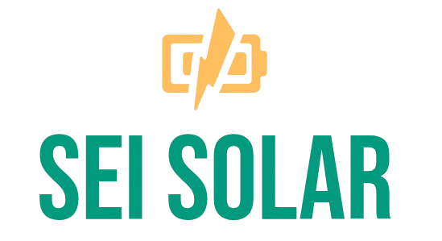
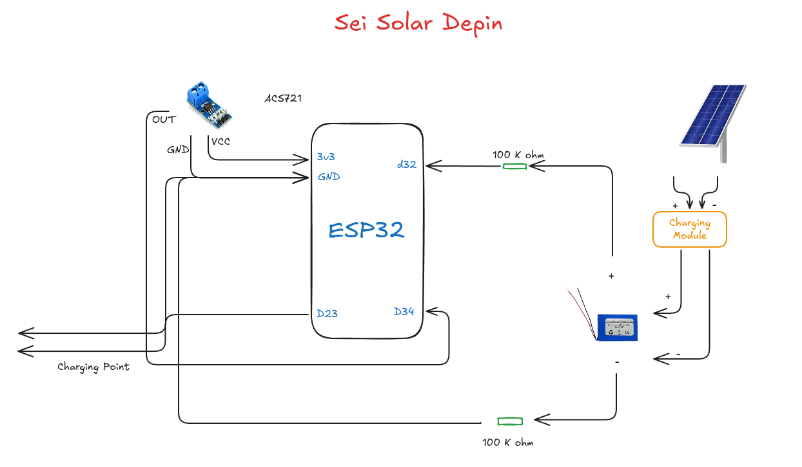

<div align="center">
  
</div>

# SEI Solar - Decentralized EV Charging Network

A comprehensive **Decentralized Physical Infrastructure Network (DePIN)** solution for electric vehicle charging, leveraging the SEI blockchain to create a sustainable, transparent, and globally accessible EV charging ecosystem with AI-powered user assistance and real-time device integration.

## 🌍 Project Vision

SEI Solar revolutionizes the EV charging industry by creating the world's first fully decentralized charging network where:

- **Station Owners** earn SEI tokens by providing solar-powered charging services
- **EV Drivers** access affordable, sustainable charging with transparent pricing
- **AI Assistants** provide personalized guidance and seamless blockchain interactions
- **Smart Contracts** ensure trustless, automated transactions and fair pricing

## ⚡ The Problem We Solve

### Current EV Charging Challenges

1. **Limited Infrastructure**: Insufficient charging stations in many regions
2. **High Costs**: Expensive installation and maintenance for traditional networks
3. **Centralized Control**: Single points of failure and price manipulation
4. **Payment Friction**: Complex payment systems and membership requirements
5. **Sustainability Concerns**: Heavy reliance on grid electricity vs renewable energy
6. **Information Asymmetry**: Lack of real-time availability and pricing transparency

### Our DePIN Solution

**Decentralized Physical Infrastructure Network (DePIN)** combines blockchain technology with physical infrastructure to create:

- **Economic Incentives**: Token rewards for infrastructure providers
- **Community Ownership**: Distributed network owned by participants
- **Transparent Pricing**: Blockchain-based price discovery
- **Global Accessibility**: Permissionless network participation
- **Sustainable Energy**: Focus on solar-powered charging stations

## 🏗️ System Architecture

<div align="center">
  
</div>

```
┌─────────────────────────────────────────────────────────────────┐
│                        SEI SOLAR DEPIN ECOSYSTEM                │
└─────────────────────────────────────────────────────────────────┘

┌─────────────────┐    ┌──────────────────┐    ┌─────────────────┐
│   EV DRIVERS    │    │  STATION OWNERS  │    │   AI ASSISTANT  │
│                 │    │                  │    │                 │
│ • Find Stations │    │ • Register Spots │    │ • Natural Chat  │
│ • Book Sessions │    │ • Set Pricing    │    │ • Tool Calling  │
│ • Pay with SEI  │    │ • Earn Rewards   │    │ • Real-time Info│
│ • Get Refunds   │    │ • Withdraw SEI   │    │ • Decimal Support│
└─────────────────┘    └──────────────────┘    └─────────────────┘
         │                        │                        │
         └────────────────────────┼────────────────────────┘
                                  │
              ┌───────────────────────────────────────┐
              │        NEXT.JS FRONTEND UI            │
              │                                       │
              │ • Role-Based Dashboards              │
              │ • MetaMask Web3 Integration          │
              │ • Real-time Blockchain Updates       │
              │ • Responsive Mobile-First Design     │
              └───────────────────────────────────────┘
                                  │
              ┌───────────────────────────────────────┐
              │         MCP SERVER LAYER              │
              │                                       │
              │ • Model Context Protocol Integration │
              │ • AI Tool Execution Engine           │
              │ • HTTP API for Browser Clients       │
              │ • Real-time Device Communication     │
              └───────────────────────────────────────┘
                                  │
    ┌─────────────────────────────┼─────────────────────────────┐
    │                             │                             │
┌───────────────┐    ┌─────────────────────┐    ┌─────────────────┐
│ SEI BLOCKCHAIN│    │   SMART CONTRACTS   │    │ ESP32 DEVICES   │
│               │    │                     │    │                 │
│ • Chain ID 1328│   │ • UserWallet.sol    │    │ • Solar Panels  │
│ • Gas in SEI  │    │ • ChargingStation.sol│   │ • Battery Storage│
│ • Testnet     │    │ • ChargingBooking.sol│   │ • HTTP API      │
│ • Decentralized│   │ • Fixed-Point Math  │    │ • Real-time Data│
└───────────────┘    └─────────────────────┘    └─────────────────┘
```

## 📦 Component Overview

### 1. 🔗 Smart Contracts ([`smartcontract/`](smartcontract/))
**Blockchain Foundation Layer**
- **UserWallet.sol**: Gas-optimized proxy execution and balance management
- **ChargingStation.sol**: Device registry with GPS coordinates and pricing
- **ChargingBooking.sol**: Booking system with decimal support and automatic refunds

**Key Features:**
- Fixed-point arithmetic supporting 3 decimal places (0.001 precision)
- Emergency stop functionality with automatic refund calculation
- SEI-native gas management and transaction optimization
- Comprehensive event logging for transparency

### 2. 🖥️ MCP Server ([`mcp-server/`](mcp-server/))
**AI Integration and Blockchain Interface Layer**
- Model Context Protocol server connecting AI assistants to blockchain
- 25+ specialized tools for charging station operations
- Real-time device communication via HTTP endpoints
- Comprehensive diagnostics and debugging capabilities

**Core Tools:**
- Station discovery with GPS-based proximity search
- Real-time battery capacity monitoring
- Charging time estimation and price calculation
- Emergency stop with device synchronization

### 3. 🌐 Frontend UI ([`ui/`](ui/))
**User Interface and Web3 Integration Layer**
- Next.js 15 application with role-based dashboards
- MetaMask integration with automatic SEI network switching
- AI chatbot with natural language blockchain interactions
- Responsive design optimized for mobile and desktop

**User Experiences:**
- **Station Owners**: Registration, earnings tracking, withdrawal management
- **EV Drivers**: Station discovery, booking system, wallet management
- **AI Assistant**: Context-aware help with decimal value support

### 4. ⚡ ESP32 Hardware ([`esp32/`](esp32/))
**Physical Device Interface Layer**
- Solar-powered charging station controllers
- Real-time power monitoring and battery management
- HTTP API for remote device control and data collection
- Precise energy delivery tracking with automatic shutoff

**Device Capabilities:**
- Battery voltage and capacity monitoring
- PWM-controlled power output (0.001W - 3W range)
- Actual consumption tracking with Math.ceil rounding
- Network connectivity for blockchain synchronization

## 🔧 Quick Start Guide

### Prerequisites
- **Node.js 18+** with npm
- **MetaMask** browser extension  
- **Python 3.12+** with UV package manager
- **Hardhat** for smart contract development

### 1. Clone & Setup
```bash
git clone <repository-url>

# Install all dependencies
npm install                    # Root dependencies
cd smartcontract && npm install && cd ..
cd mcp-server && uv sync && cd ..
cd ui && npm install && cd ..
```

### 2. Deploy Smart Contracts
```bash
cd smartcontract

Or deploy to SEI testnet
npm run deploy:testnet
```

### 3. Start MCP Server
```bash
cd mcp-server

# Configure environment
cp .env.example .env
# Edit .env with your settings

# Start server
uv run python main.py
```

### 4. Launch Frontend
```bash
cd ui

# Configure environment  
cp .env.example .env
# Edit .env.local with your settings

# Start development server
npm run dev
```

### 5. Access Application
- **Frontend**: [http://localhost:3000](http://localhost:3000)
- **MCP Server**: [http://localhost:8080](http://localhost:8080)

## 💰 Tokenomics & Business Model

### SEI Token Economics

```
┌─────────────────────────────────────────────────────────────────┐
│                         TOKEN FLOW                              │
└─────────────────────────────────────────────────────────────────┘

EV Drivers                 SEI Network                Station Owners
    │                          │                          │
    │ 1. Deposit SEI           │                          │
    ├─────────────────────────→│                          │
    │                          │                          │
    │ 2. Pay for charging      │ 3. Transfer payment      │
    ├─────────────────────────→├─────────────────────────→│
    │                          │                          │
    │ 4. Receive refund        │ 5. Deduct from earnings  │
    │←─────────────────────────├←─────────────────────────┤
    │                          │                          │
    │                          │ 6. Withdraw earnings     │
    │                          │←─────────────────────────┤
```

### Revenue Streams

1. **Transaction Fees**: Small percentage on each charging session
2. **Network Effects**: Increased utility drives token demand
3. **Premium Features**: Advanced analytics and priority booking
4. **Hardware Sales**: ESP32 charging station kits

### Incentive Alignment

- **Station Owners**: Earn passive income from solar investments
- **EV Drivers**: Access to affordable, sustainable charging
- **Token Holders**: Network growth increases token utility
- **Developers**: Open-source ecosystem with grant opportunities

## 🌱 Sustainability Impact

### Environmental Benefits

- **100% Solar Power**: All charging stations powered by renewable energy
- **Reduced Carbon Footprint**: Eliminates fossil fuel dependency
- **Grid Independence**: Decentralized energy distribution
- **Circular Economy**: Incentivizes renewable energy adoption

### Social Impact

- **Energy Democratization**: Anyone can become an energy provider
- **Rural Accessibility**: Enables charging infrastructure in remote areas
- **Economic Opportunity**: New income streams for property owners
- **Technology Education**: Open-source learning platform


### DePIN Innovations

1. **Community-Owned Infrastructure**: Participants own network assets
2. **Tokenized Energy Trading**: Peer-to-peer energy marketplace
3. **Geographic Incentives**: Higher rewards in underserved areas
4. **Quality Assurance**: Reputation system for station reliability
5. **Interoperability**: Open standards for hardware integration

## 🛡️ Security & Trust

### Smart Contract Security
- **Comprehensive Testing**: 100% test coverage with edge cases
- **Access Controls**: Multi-signature admin functions
- **Upgrade Patterns**: Safe contract upgrade mechanisms
- **External Audits**: Professional security audits planned

### Network Security
- **Decentralization**: No single points of failure
- **Consensus Mechanisms**: SEI blockchain validation
- **Encryption**: End-to-end encrypted communications
- **Privacy**: User data protection and anonymization

## 📊 Technical Specifications

### Deployed Smart Contracts

**SEI Testnet (Chain ID: 1328)**

| Contract | Address | Purpose |
|----------|---------|---------|
| **UserWallet** | [`0xFf54Bbffb72AF284B92997630736FDCEf8E11B2A`](https://seitrace.com/address/0xFf54Bbffb72AF284B92997630736FDCEf8E11B2A) | User balance & transaction management |
| **ChargingStation** | [`0xc5B696E949B356321d80E834E9D7c07cBdFEfD56`](https://seitrace.com/address/0xc5B696E949B356321d80E834E9D7c07cBdFEfD56) | Station registry & device URLs |
| **ChargingBooking** | [`0x13d75A4C46b07aBf5D112BCdbC17328F57b519FA`](https://seitrace.com/address/0x13d75A4C46b07aBf5D112BCdbC17328F57b519FA) | Booking & payment processing |

### Blockchain Layer
- **Network**: SEI Testnet (Chain ID: 1328)
- **Consensus**: Proof-of-Stake with Tendermint
- **Transaction Finality**: ~600ms average
- **Gas Costs**: Optimized for micro-transactions
- **Smart Contract Language**: Solidity 0.8.28+
- **Explorer**: [SEI Trace](https://seitrace.com)

### Hardware Requirements
- **ESP32**: Dual-core processor with WiFi
- **Solar Panel**: 5W minimum output
- **Battery**: 2000mAh lithium-ion minimum
- **Sensors**: Current (ACS712) and voltage monitoring
- **Communication**: HTTP/TCP over WiFi

### Software Stack
- **Frontend**: Next.js 15, TypeScript, Tailwind CSS
- **Backend**: Python 3.12+, FastMCP, FastAPI
- **Blockchain**: Hardhat, ethers.js, Web3 integration
- **AI**: OpenAI GPT-4, Model Context Protocol
- **Database**: Blockchain-native storage

## Mimicking the ESP32

1. Enter the mock-esp32
2. run **uv sync** and **uv run main.py**
3. Try to expose the server using **ngrok**


## 🔗 Quick Navigation

| Component | Purpose | Documentation |
|-----------|---------|---------------|
| [ESP32 Hardware](esp32/) | Physical charging stations | [ESP32 README](esp32/README.md) |
| [Smart Contracts](smartcontract/) | Blockchain logic layer | [Contracts README](smartcontract/README.md) |  
| [MCP Server](mcp-server/) | AI and API integration | [MCP README](mcp-server/README.md) |
| [Frontend UI](ui/) | User interface application | [UI README](ui/README.md) |

---


**Built with ❤️ for a sustainable, decentralized future**

SEI Solar represents the convergence of blockchain technology, artificial intelligence, and renewable energy to create a truly decentralized physical infrastructure network that benefits everyone while protecting our planet. Join us in building the future of sustainable transportation! 🌍⚡🚗